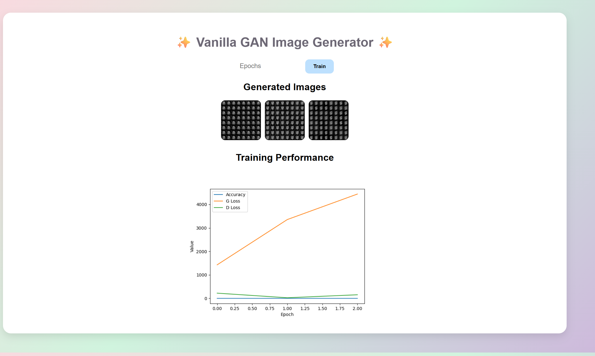

# 🎨 Vanilla GAN Synthetic Image Generator

A simple web-based Vanilla GAN project that generates synthetic handwritten digit images using PyTorch and displays results in a Flask dashboard.

---
## 📌 Introduction

Generative Adversarial Networks (GANs) are powerful deep learning models capable of generating realistic synthetic data.  
This project implements a **Vanilla GAN using PyTorch** and integrates it with a **Flask web dashboard** to allow users to train the model interactively and visualize generated images in real time.

The system enables users to dynamically control the number of training epochs, observe generated samples after each epoch, and monitor performance metrics such as accuracy and loss curves through a clean pastel-themed web interface.

This project demonstrates the practical application of deep learning, adversarial training, and full-stack deployment in a single interactive system.

---


## 🚀 Features

✅ Vanilla GAN (Generator + Discriminator)  
✅ Synthetic image generation  
✅ MNIST dataset training  
✅ Accuracy + Loss graph  
✅ Pastel color frontend  
✅ User controlled epochs  
✅ Live image gallery  
✅ Flask web interface  

---

## 🛠 Tech Stack

- Python
- PyTorch
- Flask
- Matplotlib
- HTML/CSS

---

## 📂 Project Structure

```
project/
│
├── app.py              # Flask frontend
├── train.py            # GAN training logic
├── models.py           # Generator + Discriminator
├── metrics.py          # Accuracy calculation
├── templates/
│   └── index.html
├── static/generated/   # Saved images + graphs
└── README.md
```

---

## ⚙️ Installation

### 1. Clone repo
```
git clone <your-repo-url>
cd vanilla-gan-app
```

### 2. Install dependencies
```
pip install torch torchvision flask matplotlib
```

---

## ▶️ Run

```
python app.py
```

Open browser:
```
http://127.0.0.1:5000
```

---

## 📊 Output

- Generated images per epoch
- Accuracy graph
- Loss curves

---

## 🧠 How it Works

1. Generator creates fake images from random noise
2. Discriminator classifies real vs fake
3. Both networks compete and improve
4. Images saved every epoch
5. Flask dashboard shows results

---

## 📸 Screenshots


We can increase the epochs as much as we want and it genarates images and a chart of Accuarcy ,G_loss,D_loss
---

## 💡 Future Improvements

- DCGAN
- FID score
- Live progress bar
- CIFAR-10 support
- Model download

---

## 👩‍💻 Author
Ishita Sai Madala
